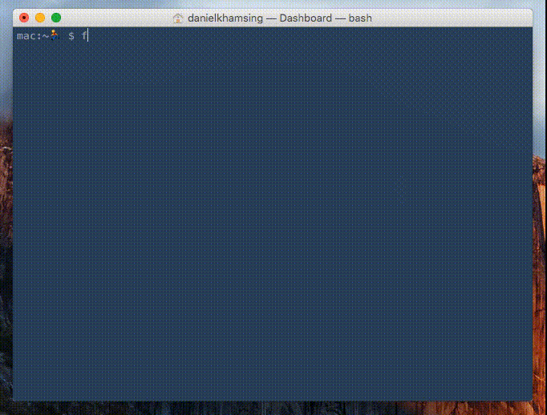

# Frankenstein

`frankenstein` checks for live URLs on a page and works with [GitHub](#github) & [Travis](#travis).

[](https://travis-ci.org/dkhamsing/frankenstein)



This is still a [work in progress](https://github.com/dkhamsing/frankenstein/issues/1) :runner: :octocat: :construction_worker:

## Installation

``` bash
git clone https://github.com/dkhamsing/frankenstein.git
cd frankenstein
bundle install

# you're good to go 😎
```

## Usage

``` bash
frankenstein <url|github repo|file> [-cfmv] [log] [pull] [row=d] [stars] [threads=d]
```

### Examples

``` bash
$ frankenstein https://fastlane.tools

🏃  Processing links on https://fastlane.tools ...
🔎  Checking 50 links
1/50 	 ✅   https://github.com/krausefx/fastlane
2/50 	 ✅   https://github.com/KrauseFx/fastlane
# ...
📋  frankenstein results: 4 issues (8%)
   (4 of 50 links)
🔶  301 https://t.co/an02Vvi8Tl
# ...
🔶  4 redirects
https://t.co/an02Vvi8Tl redirects to
https://github.com/fastlane/snapshot
# ...
🕐  Time elapsed: 17.51 seconds

🏃  No failures for https://fastlane.tools
```

```
✅ 200 ok
🔶 3xx redirect
🔴 4xx error
⚪ other
```

``` bash
$ frankenstein README.md # file on disk
$ frankenstein dkhamsing/open-source-ios-apps # GitHub repo
```

``` bash
$ frankenstein dkhamsing/open-source-ios-apps -f # add a controlled failure

🏃  Processing links on https://raw.githubusercontent.com/dkhamsing/open-source-ios-apps/master/README.md ...
🔎  Checking 351 links
1/351 	 🔴 404 https://github.com/dkhamsing/controlled/error # controlled failure
2/351 	 ✅   https://github.com/dkhamsing/open-source-ios-apps/issues
3/351 	 ✅   https://github.com/dkhamsing/open-source-ios-apps/pulls
# ...
```

``` bash
$ frankenstein matteocrippa/awesome-swift -m # minimized result output
$ frankenstein matteocrippa/awesome-swift -m row=5 threads=0 # change number of items per row (10 is the default, row option requires threads=0)

🏃  Processing links on https://raw.githubusercontent.com/matteocrippa/awesome-swift/master/README.md ...
🔎  Checking 456 links:
✅ ✅ ✅ ✅ ✅ 5
✅ ✅ ✅ ✅ ✅ 10
# ...
```

``` bash
$ frankenstein dkhamsing/open-source-ios-apps -v # verbose output
$ frankenstein dkhamsing/open-source-ios-apps log # write log to a file named franken_log
$ frankenstein dkhamsing/open-source-ios-apps -fv log # combine flags and options (flags have to be ahead of options)
$ frankenstein dkhamsing/open-source-ios-apps threads=10 # use 10 parallel threads (the default is 5, use threads=0 to disable threading)
```

#### GitHub

Fetching star count for repos and creating a pull request for redirects requires a GitHub account with username and passwords set in a [.netrc file](http://octokit.github.io/octokit.rb/#Using_a__netrc_file).

`-c` `stars`

``` bash
$ frankenstein dkhamsing/open-source-ios-apps stars # fetch GitHub star count only and skip checking urls
$ frankenstein dkhamsing/open-source-ios-apps -c # fetch GitHub star count after checking urls

🏃  Processing links on https://raw.githubusercontent.com/dkhamsing/open-source-ios-apps/master/README.md ...
🔎  Checking 350 links
1/350 	 ✅   https://github.com/dkhamsing/open-source-ios-apps/issues
2/350 	 ✅   https://github.com/dkhamsing/open-source-ios-apps/pulls
# ...
🔎  Getting star count for 228 GitHub repos
1/226 	 ⭐️  2709 iCHAIT/awesome-osx 🔥 🔥 🔥 🔥 🔥
2/226 	 ⭐️  2275 pcqpcq/open-source-android-apps 🔥 🔥 🔥 🔥 🔥
3/226 	 ⭐️  378 belm/BaiduFM-Swift 🔥 🔥
# ...
```

```
 100+ Stars: 🔥
 200+ Stars: 🔥🔥
 500+ Stars: 🔥🔥🔥
1000+ Stars: 🔥🔥🔥🔥
2000+ Stars: 🔥🔥🔥🔥🔥
```

`pull`

``` bash
$ frankenstein fastlane/sigh pull # create a pull request replacing redirects

🏃  Processing links for https://raw.githubusercontent.com/fastlane/sigh/master/README.md ...
🔎  Checking 23 links
1/23 	 🔶  301 https://github.com/KrauseFx/fastlane
2/23 	 🔶  301 https://github.com/KrauseFx/deliver
#...
🔶  10 redirects
https://github.com/KrauseFx/fastlane redirects to
https://github.com/fastlane/fastlane
#...
Creating pull request on GitHub for fastlane/sigh ...
Pull request created: https://github.com/fastlane/sigh/pull/195

🕐  Time elapsed: 12.3 seconds

🏃  No failures for fastlane/sigh
```

Example uses of `frankenstein` with `pull` option

- https://github.com/fastlane/sigh/pull/195
- https://github.com/fastlane/frameit/pull/65
- https://github.com/dkhamsing/BrandColors/pull/11

#### White list

Some URLs that are meant to be redirected (i.e. badge, authentication) have been [white listed](lib/frankenstein/constants.rb).

### Travis

- You can use `frankenstein` with [Travis](https://travis-ci.org/) to validate commits on GitHub.
- Here is [a validation](https://travis-ci.org/dkhamsing/open-source-ios-apps/builds/87775142) on a [pull request](https://github.com/dkhamsing/open-source-ios-apps/pull/139) for [dkhamsing/open-source-ios-apps](https://github.com/dkhamsing/open-source-ios-apps).

Example `.travis.yml` file

```
language: ruby
rvm:
  - 2.2
before_script:
  - wget https://codeload.github.com/dkhamsing/frankenstein/tar.gz/1.0-wip -O /tmp/frankenstein.tar.gz
  - tar -xvf /tmp/frankenstein.tar.gz
  - export PATH=$PATH:$PWD/frankenstein-1.0-wip/bin/
  - cd frankenstein-1.0-wip
  - bundle install
script:  
  - frankenstein ../README.md
```

## Credits

- `faraday`, `parallel`, `octokit` and [more](lib/frankenstein.rb).
- [@eteubert](http://stackoverflow.com/questions/5532362/how-do-i-get-the-destination-url-of-a-shortened-url-using-ruby/20818142#20818142) and [@mgreensmith](http://mattgreensmith.net/2013/08/08/commit-directly-to-github-via-api-with-octokit/).
- [awesome-aws](https://github.com/donnemartin/awesome-aws) for that 🔥.
- [giphy](http://giphy.com/gifs/2MMB4JT8lokbS) for "it's alive" image.

## Contact

- [github.com/dkhamsing](https://github.com/dkhamsing)
- [twitter.com/dkhamsing](https://twitter.com/dkhamsing)

## License

This project is available under the MIT license. See the [LICENSE](LICENSE) file for more info.
